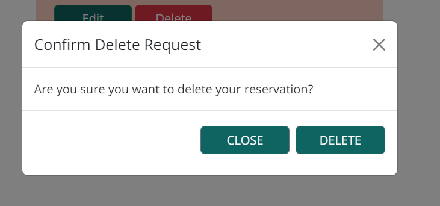

# HAPPY LEEKS RESTAURANT
Happy Leeks is a vegan Cafe based in Dublin that welcomes all people and serves delicious brunch items to customers. The goal is to create a nurturing space where people can connect, explore sustainable living, and indulge in mouthwatering dishes.
The website includes a Menu, Reservation options and account creations for the individual user. 

Link to deployed website : [Happy Leeks](https://8000-sinastiller-pp4restaura-4dmd1gro0s9.ws-eu101.gitpod.io/)

## Contents

* [User Experience](#user-experience)
    * [User Stories](#user-stories)

* [Design](#design)
    * [Colour Scheme](#colourscheme)
    * [Typography](#typography)
    * [Imagery](#imagery)
    * [Wireframes](#wireframes)

* [Features](#features)
    * [General Features](#general-features)
    * [Future Considerations](#future-considerations)
    * [Accessibility](#accessibility)

* [Technologies Used](#technologies-used)
    * [Languages Used](#languages-used)
    * [Frameworks, Libraries & Programs Used](#frameworks-libraries-programs-used)

* [Deployment & Local Development](#deployment&localdevelopment)
    * [Deployment](#deployment)
    * [Local Development](#local-development)
        * [How to Fork](#how-to-fork)
        * [How to Clone](#how-to-clone)

* [Testing](#testing)

* [Credits](#credits)
    * [Code Used](#code-used)
    * [Content](#content)
    * [Media](#media)
    * [Acknowledgements](#acknowledgements)

---

## [**User Experience**](#user-experience)

Happy Leeks should invite peole to visit the cafe. The reservation system makes it possibe for the customer to book a table in addvance.

### [User Stories](#user-stories)

#### User
- As a site user I can visit the restaurant's landing page so that I can find information about the restaurant.
- As a site user I can view the menu so that I know what food the restaurant has to offer.
- As a site user I can register an account so that I can book a table for one or more guests at a particular time and date.
- As a logged in user I can make a booking so that I can book a table/multiple tables for one or more guests at a specific date and time, view and update my existing booking/s or delete any existing booking.
- As a logged-in user I can see my login status so that I know that I am logged in.
- As a site user I can find links to their social media so that I can follow the restaurant on social media.
- As a site user I can view essential information so that I can find out about the address, business hours, phone number and other important information.
- As a site user I can view photos so that I get a feel of the atmosphere and what style of food is served in the restaurant.

#### Admin
- As an admin I can manage items on the menu so that I can create, view, update and delete any items.
- As an admin I can manage the bookings so that I can create, view, update and delete any bookings and avoid any double bookings.

## [**Design**](#design)

### [Colour Scheme](#colour-scheme)
This website uses a palette of lighter gray and blue tones, as well as light and dark green and light pink tones. It also uses some variants of the same colour scheme belonging to their colour family. It was created by using [Coolors](https://coolors.co/).

### [Typography](#typography)
I have imported the following Google Fonts:
* Playfair Display 400, 500 for headings on the website.
* Open Sans 300, 400, 600 for the body text on the website.

### [Imagery](#imagery)
Imagery is used regarding restaurant environment and food content on the website. They are taken from various websites, which are credited down below in the [Credits](#credits) section.

### [Wireframes](#wireframes)
I have used [Figma](https://www.figma.com/) to create the wireframes. Each wireframe stands for the .html pages. Boxes with an X-line stand for an image. Subject is to change during the production of this website.

#### Home Page

#### Login Page

#### Logged in user

#### Signup Page

#### Menu Page

#### Booking Page

#### Manage Booking

## [**Features**](#features)

### [General features](#general-features)
The webpage consists of a Homepage, Menu page, Booking page, Manage Booking page, Login page, Signup page and Logout page.

All of these pages contain:
* A responsive navigation bar:
    * The name of the restaurant is positioned on the left-hand side with the logo on the right of it. Both link to Home Page.
    * The other navigation links are located on the right-hand side.
    * The colour is a shade of light green. 
    
    * When user is not logged on the dropdown menu links include link to Sign Up and Login.
    
    * When user is loggged in, the link to Book a Table appears in the navbar as well as links to Manage Booking and Logout on the dropdown menu.
    
    
    * When hovered over navbar links colour changes to a darker shade.

* A responsive footer :
    * The footer contains the social media icons of Facebook, Instagram, Twitter, and Pinterest, which open all in a new tab when clicked on.
    * It also contains the copyright with the current year.
    

#### Home Page

The Homepage is the langing page of the website, where a user lands first when opening the url. It contains the navbar at the top and footer at the bottom. Between the user can find a small about section with an image of the interior of the restaurant, a gallery section to view some of the dishes, the decoration and atmosphere of the restaurant. Below is the essential information section, where the user can find the location, opening times and contact details.
* About Section
    
* Gallery Section
    
* Essential Information Section

#### Menu Page
The Menu page can be reached from the landing page. It contains the navbar at the top and footer at the bottom. The menu contains four categories (COOL CRAVINGS, HOT 'N' TASTY TREATS, SIP & SAVOUR, SWEET SURRENDERS). At the top of each menu card the user can find the food category, with the individual menu items listed below including a small description of the item and the price.

#### Signup Page
The Signup page can be reached via the dropdown link from the navbar. It contains the navbar at the top and footer at the bottom. The user will be prompted with a Signup form, to enter their username, email(optional), password and confirm password. If they have already an account the can reach the Login page via the link just at the top of the Signup form. Only valid input is allowed and user must click Signup button to proceed with registering. Once completed the user will be redirected to the landing page.

#### Login Page
The Login page can be reached via the dropdown link from the navbar. It contains the navbar at the top and footer at the bottom. The user will be prompted with a Login form, to enter their username and password, which they have created an account with. If they have not yet created an account the can reach the Signup page via the link just at the top of the Login form. As only valid input is allowed, a message will pop up that login was unsuccessful if user has entered incorrect details. User must click Log In button to log in. Once completed the user will be redirected to the landing page and message will pop up that user is logged in.

#### Booking Page
The Booking page can be reached via the navbar once the user has logged in. It contains the navbar at the top and footer at the bottom. The user will be prompted with a Booking form, to select the number of guests, their name, phone number, preferred date and time. To fulfill the booking the have to confirm by clicking the "Make reservation" button. If there was any non-valid input, a message will pop up that booking was unsuccessful and the user will be asked to re-enter the details before they can proceed. Once booking is complete the user will be redirected to the Manage Booking page and a message will pop up that booking was successful.

#### Manage Booking Page
The Manage Booking page can be reached via the dropdown menu once the user has logged in. It contains the navbar at the top and footer at the bottom. It displays any existing bookings to the user, that were made by them. Information containing the booking name, date & time of booking and the number of the attending guest. The user has also the possibilty to update and delete their booking. 

By clicking on "Edit", the user lands on edit_booking.html where they can updated their booking. It is the same booking form used for booking a table, but with details already filled in, when the booking was made. The user is able to make any adjustments and once happy can confirm their booking by "Update Reservation". If there was any non-valid input, a message will pop up that update was unsuccessful and the user will be asked to re-enter the details. 

If all valid a modal will pop up for the user to confirm their request. 

Once accepted, user will be redirected to Manage Booking page and a message will pop up that update was successfull. They now can view their updated booking.

If they choose to delete and existing booking, they can do so by clicking on "Delete". A modal will pop up to assure them of their action. Once booking is deleted a message will pop up confirming the deleted booking. 

#### Logout Page
The Logout Booking page can be reached via the dropdown menu once the user has logged in. It contains the navbar at the top and footer at the bottom. The user is asked to confirm if they want to sign out. If user proceeds, they will be directed to the landing page. A message will pop up to let them know that they have logged out successfully.

### [Future Considerations](#future-considerations)
Future features that could be implemented on the website could include being able to add reviews and view reviews of other customers. Another implementation could be an online ordering system.

### [Accessibility](#accessibility)
For better accessibility  I added alt-labels to all my images for vision-impaired users. Accessibilty was also tested on lighthouse, which reached a very high score on every testing.

## [**Technologies Used**](#technologies-used)

### [Languages Used](#languages-used)
* *HTML*
* *Python*
* *CSS*
* *JavaScript*

### [Frameworks, Libraries & Programs Used](#frameworks-libraries--programs-used)
- [Django](https://www.djangoproject.com/) - Main python framework used for this project.
- [ElephantSQL](https://www.elephantsql.com/) - Stores database for this project.
- [Heroku](https://heroku.com/) - Cloud-based platform used to deploy this project.
- [Bootstrap 5.3](https://getbootstrap.com/) - CSS styling used for decorating HTML content.
- [Github](https://github.com/) - Used for version control and agile development progress.
- [Gitpod](https://www.gitpod.io/) - Used as cloud-development platform.
- [Google Fonts](https://fonts.google.com/) - Used for imported fonts for this project.
- [Am I responsive](https://ui.dev/amiresponsive) - Used to check if website is fully responsive.
- [PEP8](https://pep8ci.herokuapp.com/#) - Used to validate python code.
- [W3C](https://validator.w3.org/) - Used to validate HTML and CSS.
- [Favicon](https://favicon.io/favicon-generator/) - Used to create Favicon for this project.
- [Cloudinary](https://cloudinary.com/) - Used to store website images of this project on a cloud-platform.
- [Figma](https://www.figma.com/) - Used to design wireframes.
- [Font Awesome](https://fontawesome.com/) - Used for icons.
- [Coolors](https://coolors.co/) - Used to create colour palette.
- [Tiny JPG](https://tinyjpg.com/) - Used to convert images.
- [Cloud Convert](https://cloudconvert.com/jpg-to-webp) - Used to convert images.

## **Deployment & Local Development**
## Deployment
This project was created by using Gitpod. I used the pre-built template from [Code Institute](https://github.com/Code-Institute-Org/python-essentials-template).
The following commands were used:
* **git add .** - to add all the changes.
* **git commit -m "..."** - to commit all the changes to the local repository.
* **git push** - to push the committed changes to the GitHub repository.

### **Deployment to HerokuApp**
1. Create a list of requirements, commit and push to GitHub.
2. Create Account with Heroku.
3. On the Heroku Dashboard, select "create new app".
4. Give the app a name (it must be unique, as each app name can only exist once) and choose your current region.
5. Click "Create App".
6. On the "Settings" Tab, scroll to Config Vars.
7. Create a Config Var.
8. In the "KEY" field enter CREDS and for the "VALUE" field copy the creds.json link from your file and click "Add".
9. In the "KEY" field enter PORT and for the "VALUE" field enter 8000 and click "Add".
10. Add Buildpacks.
11. Choose the first one to be python and press "save".
12. Choose the second one to be nodejs and press "save".
13. Move to "Deploy" Tab.
14. Select "GitHub" as Deploment Methond and connect to your GitHub and the repository you want to upload.
15. Choose between automatic/manual deploy option.
16. After app was successfully deployed, click the "View" button to connect to webpage.

### Deployment

### Local Development

* #### How to Fork

* #### How to Clone

## **Testing**

Please find the carried out testing on [TESTING.md](TESTING.md).

## **Credits**

### Code Used
- https://www.youtube.com/playlist?list=PLBTOBXTz1YFZK0moSgoZq93V_AdvrUGSj - creating menu
- Hello Django
- I think therefore i blog
- https://blog.devgenius.io/django-tutorial-on-how-to-create-a-booking-system-for-a-health-clinic-9b1920fc2b78 --> for time.choices
- https://github.com/GeorgianF/Grace-P4-CI for update and delete modal
- https://github.com/Kaylaesmith1/bed-and-breakfast for reference throughout the project
- https://github.com/kera-cudmore/readme-examples/blob/main/milestone1-readme.md#code-used
- stackoverflow 
- W3Schools
- django documentation
- Bootstrap 
- https://django-allauth.readthedocs.io/en/latest/

### Content
- Menu from https://www.kyndcommunity.com/pages/kyndcafe, https://cafeorganic.co/

### Media
- unsplash
- pexels
### Acknowledgements
