# TESTING FOR HAPPY LEEKS RESTAURANT WEBSITE

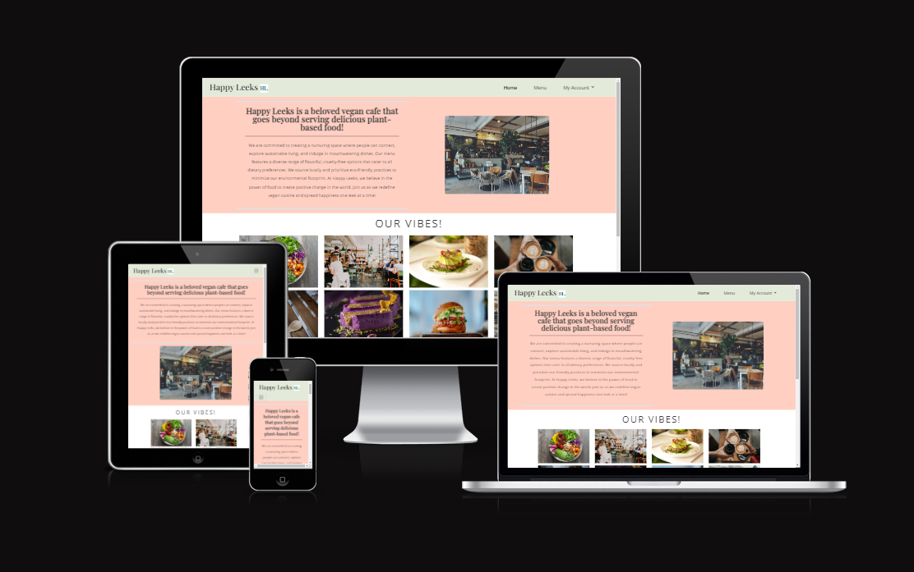

## Contents
* [Automated Testing](#automated-testing)
  * [W3C Validator](#w3c-validator)
  * [PEP8 Validator](#pep8-validator)
  * [Responsiveness](#responsiveness)
  * [Lighthouse](#lighthouse)
* [Manual Testing](#manual-testing)
* [Bugs](#bugs)
  * [Resolved Bugs](#resolved-bugs)
  * [Unresolved Bugs](#unresolved-bugs)

## [Automated Testing](#automatedtesting)

### [W3C Validator](#W3C-Validator)

[W3C](https://validator.w3.org/) was used to validate all HTML code used in this project. It was also used to validate CSS.

#### HTML

  
Home Page - No errors

  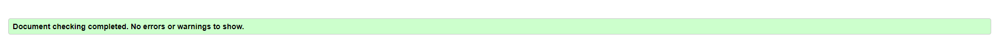

  
Menu Page - No errors

  
  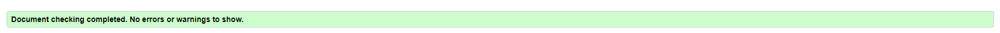

  
Login Page - No errors

  
  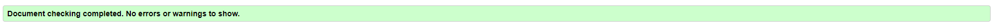

  
Signup Page - No errors

  
  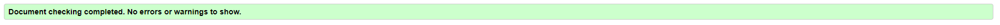

  
Bookin Page - No errors

  
  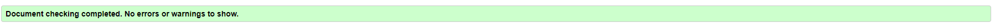

  
Manage Booking Page - No errors

  
  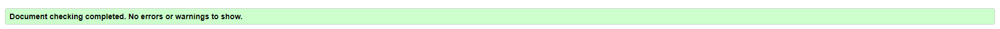

  
Update Booking Page - No errors

  
  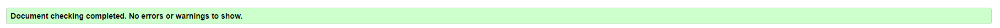

  
Logout Page - No errors

  
  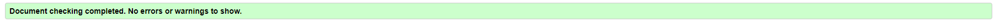

#### CSS
There were no errors found, when validating CSS.

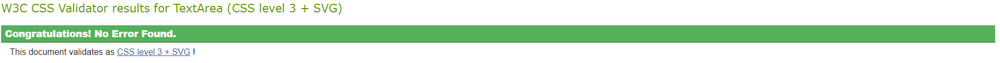

### [PEP8 Validator](#pep8validator)

* To verify that the Python Code is written within the correct structure, I tested it in the Code Institute's [PEP8 Validator](https://pep8ci.herokuapp.com/). The code was all clear, and no errors were found.

#### restaurant_website

  
asgi.py - No errors

  
  

  
settings.py - No errors, except "line too long errors"

  
  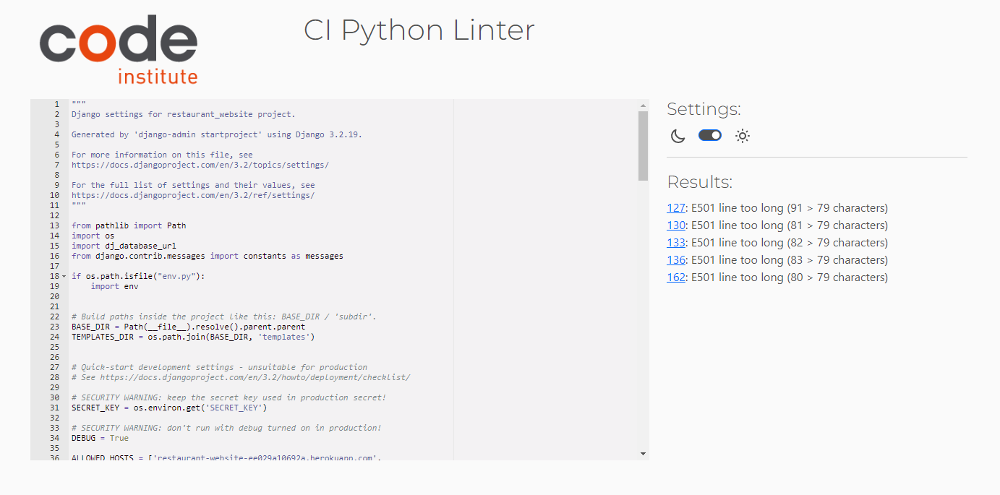

  
urls.py - No errors

  
  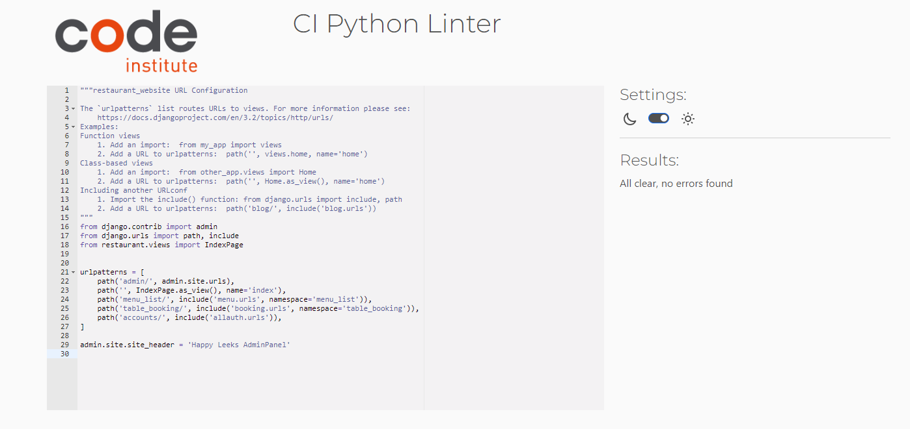

  
wsgi.py - No errors

  
  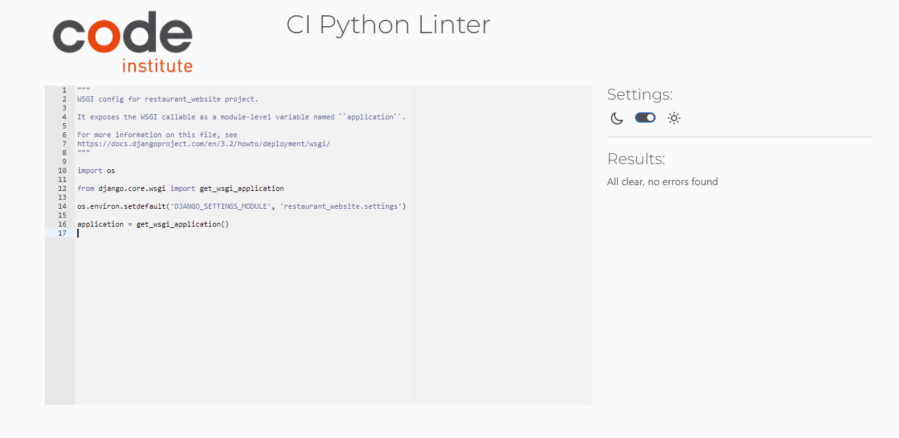

#### restaurant app

  
views.py - No errors

  
  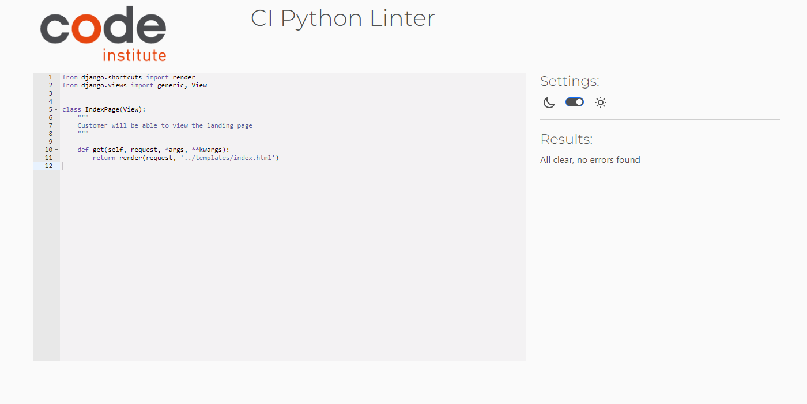

#### menu app

  
admin.py - No errors

  
  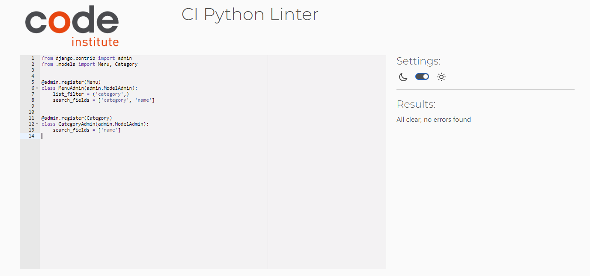

  
models.py - No errors

  
  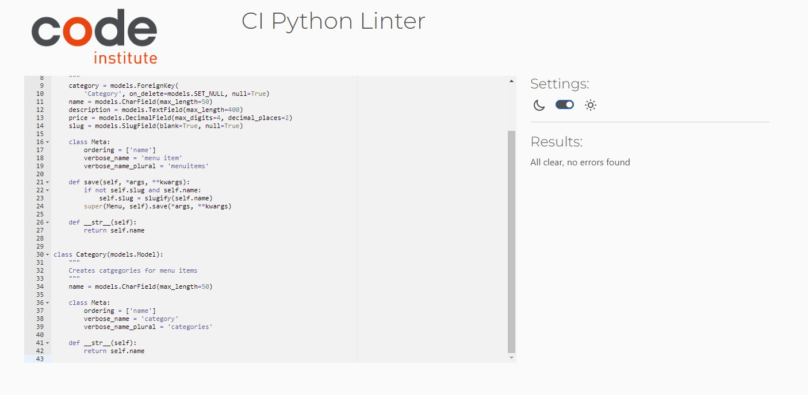

  
urls.py - No errors

  
  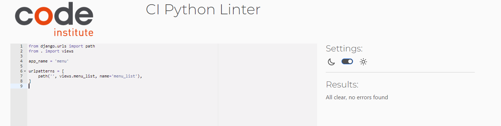

  
views.py - No errors

  
  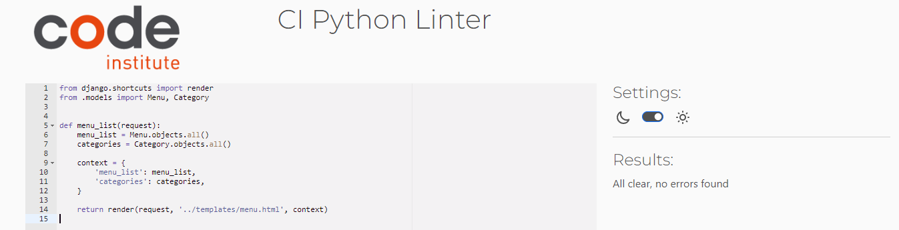

#### booking app

  
admin.py - No errors

  
  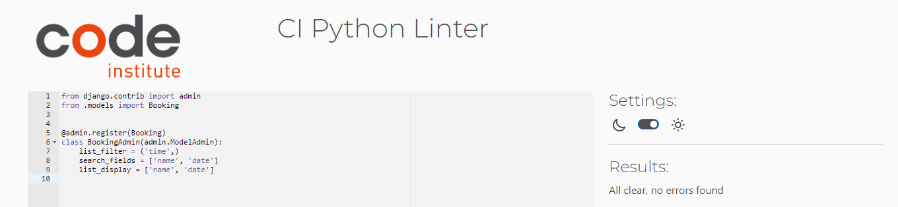

  
forms.py - No errors, except "line too long errors"

  
  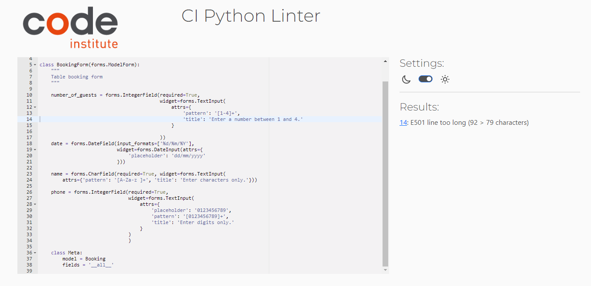

  
models.py - No errors

  
  

  
urls.py - No errors

  
  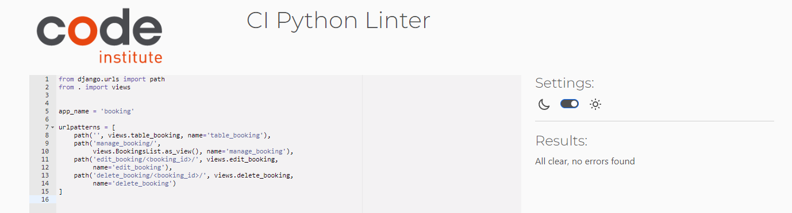

  
views.py - No errors

  
  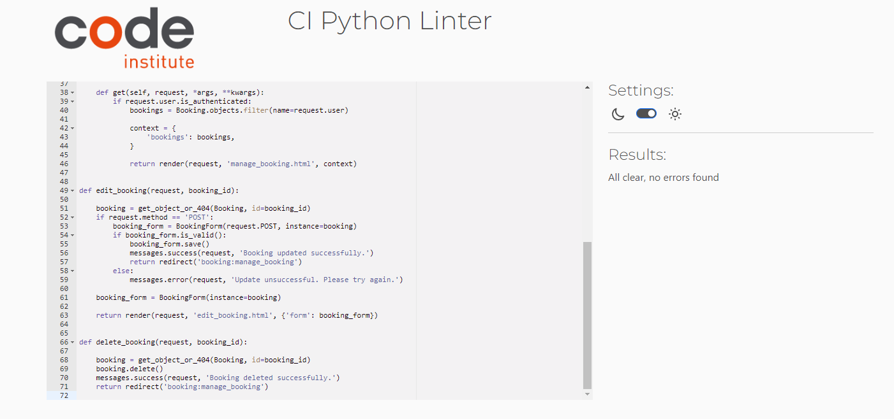

### [Responsiveness](#responsiveness)

The website was tested on a Windows Laptop and while in the inspect-mode on Google Chrome also tested on different available devices. It is fully responsive.

### [Lighthouse](#lighthouse)
Lighthouse was used to test the overall performance and accessibility, which both mentioned returned a very high rating.

  
Home Page

  
  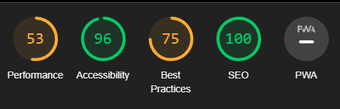

  
Menu Page

  
  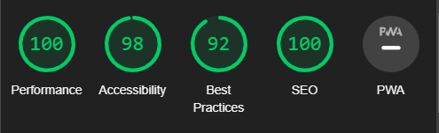

  
Signup Page

  
  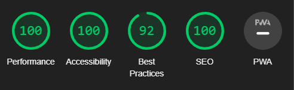

  
Login Page

  
  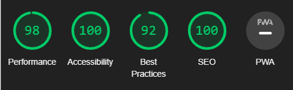

  
Booking Page

  
  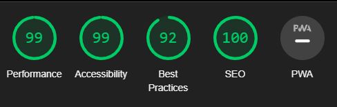

  
Manage Booking Page

  
  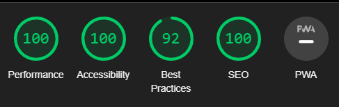

  
Update Booking Page

  
  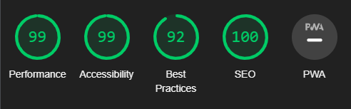

  
Logout Page

  
  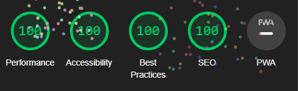

## [Manual Testing](#manualtesting)

### Home Page
Feature | Action | Expected Result | PASS/FAIL 
---|---|---|---
Homepage | Display | Hompepage is displayed when url is passed intow browser | PASS
Block Title | Display | Happy Leeks | Vegan Cafe 🌱 should be displayed when on homepage | PASS
Nabvar | Display | When user is not logged in, only links to "Home", "Menu", "My Account" should be visible | PASS
Nabvar | Display | When user is logged in, the "Book a Table" link should also be visible | PASS
Navbar Dropdown | Display | When user is not logged in, only links to "Sign Up" and "Login" should be visible | PASS
Navbar Dropdown | Display | When user is logged in, only links to "Manage Booking" and "Logout" should be visible | PASS
Navbar Dropdown | Display | When user is logged in, "My Account" should change to "Hello, {user}" | PASS
About Section | Display | Should be displayed below navbar | PASS
Gallery Section | Display | Should be displayed below about section | PASS
Essential Information Section| Display | Should be displayed below gallery section | PASS
Footer | Display | Should only be visible at the bottom of the webpage | PASS
Footer | Click | Social media links should open a blank page to each their social media pages | PASS
Navbar | Click | "Menu" Link should open menu.html | PASS
Navbar | Click | "My Account" should display a dropdown | PASS
Navbar | Click | "Sign Up" should open signup.html | PASS
Navbar | Click | "Login" should open login.html | PASS

### Menu Page
Feature | Action | Expected Result | PASS/FAIL 
---|---|---|---
Block Title | Display | Happy Leeks | Menu should be displayed when on homepage | PASS
Title | Display | Title should appear as header | PASS
Menu Card | Display | Should be displayed with four card bodies | PASS
Menu Title | Display | Should show the name of the four categories | PASS
Menu Item | Display | Should show the Name of the item, a small description and the price in € | PASS

### Sign Up Page
Feature | Action | Expected Result | PASS/FAIL 
---|---|---|---
Block Title | Display | Happy Leeks | Sign Up should be displayed when on homepage | PASS
Container | Display | Sign Up Container with Sign up Form should be visible | PASS
Log in | Click | If user has already signed up, they can click on the provided log in link switch to Login Page | PASS
Username Field | Input | User must enter the preferred username | PASS
E-Mail Field | Input | User can enter the e-mail address; only email address possible | PASS
Password Field | Input | User must enter a secure password; simple ones don't work | PASS
Passowrd(again) Field | Input | Reenter and confirm previous entered password; passwords need to match | PASS
Sign Up Button | Click | Submits user input and creates new account. User is redirected to Home Page | PASS
Django message | Display | User message will be displayed when user signed up successfully | PASS

### Login Page
Feature | Action | Expected Result | PASS/FAIL 
---|---|---|---
Block Title | Display | Happy Leeks | Login should be displayed when on homepage | PASS
Container | Display | Login Container with Sign up Form and image should be visible | PASS
Sign Up | Click | If user has not yet signed up, they can click on the provided sign up link switch to Sign Up Page | PASS
Username Field | Input | User must enter their username, which they have signed up with | PASS
Password Field | Input | User must enter their password, which they have signed up with | PASS
Remember Me | Tickbox | User can tick the box to save their log in information for log in from now on | PASS 
Log In Button | Click | Submits user input and logs in user. User is redirected to Home Page | PASS
Django message | Display | User message will be displayed when user logged in successfully | PASS

### Book a Table Page
Feature | Action | Expected Result | PASS/FAIL 
---|---|---|---
Block Title | Display | Happy Leeks | Book your Table should be displayed when on homepage | PASS
Container | Display | Booking Form container should be visible | PASS
Title | Display | Title should appear as header | PASS
Number of guests | Display | The user is prompted to enter the number of guests | PASS
Number of guests | Input | User can only submit numbers between 1-4 | PASS
Name Field | Display | The user is prompted to enter their name | PASS
Name Field | Input | User can only enter lowercase and capital letters from a-z | PASS
Phone Field | Display | The user is prompted to enter their phone number | PASS
Phone Field | Input | User can only enter 11 numbers; numbers only | PASS
Date Field | Display | The user is prompted to enter the date for their booking | PASS
Date Field | Input | User can only enter date format dd/mm/yyyy | PASS
Time Field | Display | The user is prompted to enter the time for their booking | PASS
Time Field | Input | User can ony choose any of the times provided | PASS
Make Reservation | Click | If reservation is valid, user will be redirected to Manage Booking page | PASS
Django message | Display | User message will be displayed when booking was successfull | PASS
Make Reservation | Click | If reservation is invalid, user will be prompted to change their input accordingly | PASS
Django message | Display | User message will be displayed when booking was unsuccessfull | PASS

### Manage Booking Page
Feature | Action | Expected Result | PASS/FAIL 
---|---|---|---
Bookings | Display | User's booking should be visible to them | PASS
Booking Container | Display | Should contain the name of booking, date & time, number of guest, edit & delete button | PASS
Edit | Click | User is redirected to Edit Booking Page with field already filled in with the details made at the booking | PASS
Update Reservation | Click | Modal pops up for user to confirm their booking update. If close selected reservation won't update. If update is selected booking will be updated. | PASS
Update Reservation | Click | Updates reservation if valid and redirects user to Manage Booking Page with updated booking displayed | PASS
Django message | Display | User message will be displayed when booking was updated successfully | PASS
Update Reservation | Click | If update reservation is not valid user is asked to manage their input | PASS
Django message | Display | User message will be displayed when booking update was unsuccessfull | PASS
Delete | Click | Modal pop up for user to confirm deleting their booking. If  close selected, booking won't be deleted. If delete selcted, booking will be deleted.| PASS
Django message | Display | User message will be displayed when deleting booking was unsuccessfull | PASS
Confirmed Delete | Display | Selected booking will disappear from display at Manage Booking Page | PASS

### Logout Page
Feature | Action | Expected Result | PASS/FAIL 
---|---|---|---
Sign Out Prompt | Display | User is asked if they're sure to sign out | PASS
Sign Out button | Click | User is logged out and redirected to Home Page | PASS
Django message | Display | User message will be displayed when logout was successfull | PASS

## [Bugs](#bugs)

### [Resolved Bugs](#resolvedbugs)

- Footer was visible while scrolling up and down the webpage. Taking off the class "footer-bottom" and passing it a margin and padding of 0 made the footer stick to the bottom of the webpage.
- When checking responsiveness iframe and get-in-touch container would overlap. To fix this issue I decreased the size of the iframe.

### [Unresolved Bugs](#unresolvedbugs)
- Navlinks should be active to show user which site they are currently on. I did not find out how to display this using bootstrap. 
- When displaying the existing bookings the name that appears on the booking is the actual username and not the name that was stated on the booking form.
- When asked to enter the date for the booking, also past dates are possible to be entered.