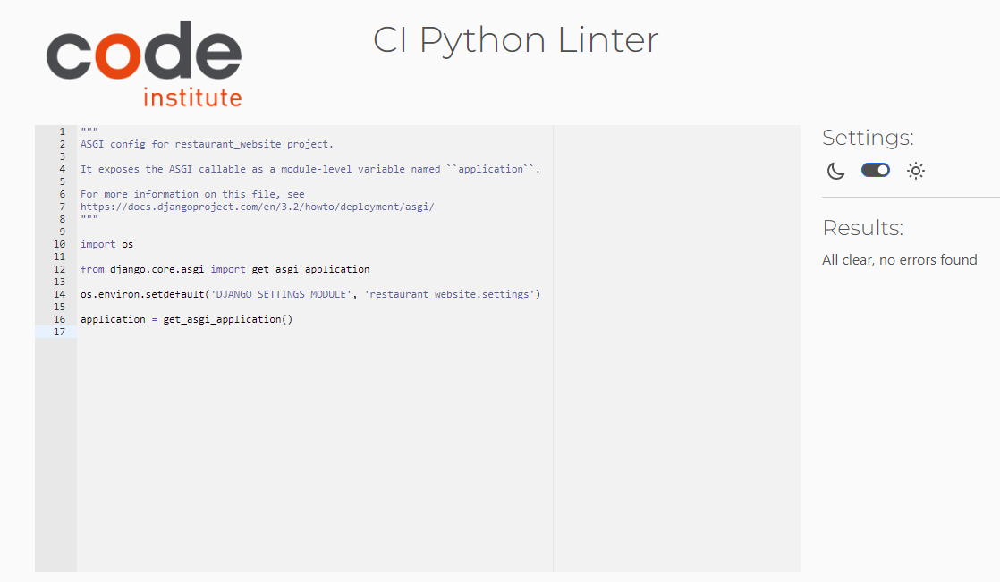
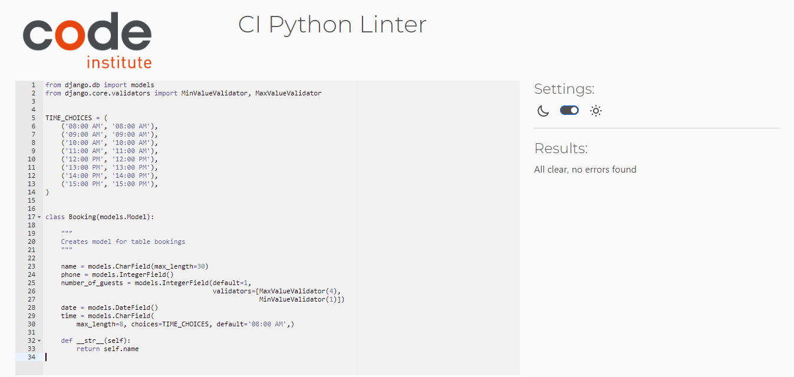

# TESTING FOR HAPPY LEEKS RESTAURANT WEBSITE

## Contents
* [Automated Testing](#automatedtesting)
  * [W3C Validator](#W3C-Validator)
  * [PEP8 Validator](#pep8validator)
  * [Responsiveness](#responsivness)
  * [Lighthouse](#lighthouse)
* [Manual Testing](#manualtesting)
* [Bugs](#bugs)
  * [Resolved Bugs](#resolvedbugs)
  * [Unresolved Bugs](#unresolvedbugs)

## [Automated Testing](#automatedtesting)

### [W3C Validator](#W3C-Validator)

[W3C](https://validator.w3.org/) was used to validate all HTML code used in this project. It was also used to validate CSS.

#### HTML

  
Home Page - No errors

  

  
Menu Page - No errors

  
  

  
Login Page - No errors

  
  

  
Signup Page - No errors

  
  

  
Bookin Page - No errors

  
  

  
Manage Booking Page - No errors

  
  

  
Update Booking Page - No errors

  
  

  
Logout Page - No errors

  
  

#### CSS
There were no errors found, when validating CSS.

### [PEP8 Validator](#pep8validator)

* To verify that the Python Code is written within the correct structure, I tested it in the Code Institute's . The code was all clear, and no errors were found.

#### restaurant_website

  
asgi.py - No errors

  
  

  
settings.py - No errors, except "line too long errors"

  
  

  
urls.py - No errors

  
  

  
wsgi.py - No errors

  
  

#### restaurant app

  
views.py - No errors

  
  

#### menu App

  
admin.py - No errors

  
  

  
models.py - No errors

  
  

  
urls.py - No errors

  
  

  
views.py - No errors

  
  

#### booking app

  
admin.py - No errors

  
  

  
forms.py - No errors, except "line too long errors"

  
  

  
models.py - No errors

  
  

  
urls.py - No errors

  
  

  
views.py - No errors

  
  

### [Responsiveness](#responsivness)

The website was tested on a Windows Laptop and while in the inspect-mode on Google Chrome also tested on different available devices. It is fully responsive.

### [Lighthouse](#lighthouse)
Lighthouse was used to test the overall performance and accessibility, which both mentioned returned a very high rating.

  
Home Page

  
  

  
Menu Page

  
  

  
Signup Page

  
  

  
Login Page

  
  

  
Booking Page

  
  

  
Manage Booking Page

  
  

  
Update Booking Page

  
  

  
Logout Page

  
  

## [Manual Testing](#manualtesting)

### Home Page
Feature | Action | Expected Result | PASS/FAIL 
---|---|---|---
Homepage | Display | Hompepage is displayed when url is passed intow browser | PASS
Block Title | Display | Vegan Cafe 🌱 should be displayed when on homepage | PASS
Nabvar | Display | When user is not logged, only links to "Home", "Menu", "My Account" should be visible | PASS
Navbar Dropdown | Display | When user is not logged in, only links to "Sign Up" and "Login" should be visible | PASS
About Section | Display | Should be displayed below navbar | PASS
Gallery Section | Display | Should be displayed below about section | PASS
Essential Information Section| Display | Should be displayed below gallery section | PASS
Footer | Display | Should only be visible at the bottom of the webpage | PASS
Footer | Links | Social media links should open a blank page to each their social media pages | PASS
Navbar | Links | "Menu" Link should open menu.html | PASS
Navbar | Links | "My Account" should display a dropdown | PASS
Navbar | Links | "Sign Up" should open signup.html | PASS
Navbar | Links | "Login" should open login.html | PASS

### Menu Page
Feature | Action | Expected Result | PASS/FAIL 
---|---|---|---

## [Bugs](#bugs)

### [Resolved Bugs](#resolvedbugs)

Footer was visible while scrolling up and down the webpage. Taking off the class "footer-bottom" and passing it a margin and padding of 0 made the footer stick to the bottom of the webpage.

### [Unresolved Bugs](#unresolvedbugs)
- Navlinks should be active to show user which site they are currently on. I did not find out how to display this using bootstrap. 
- When displaying the existing bookings the name that appears on the booking is the actual username and not the name that was stated on the booking form.
- When asked to enter the date for the booking, also past dates are possible to be entered.